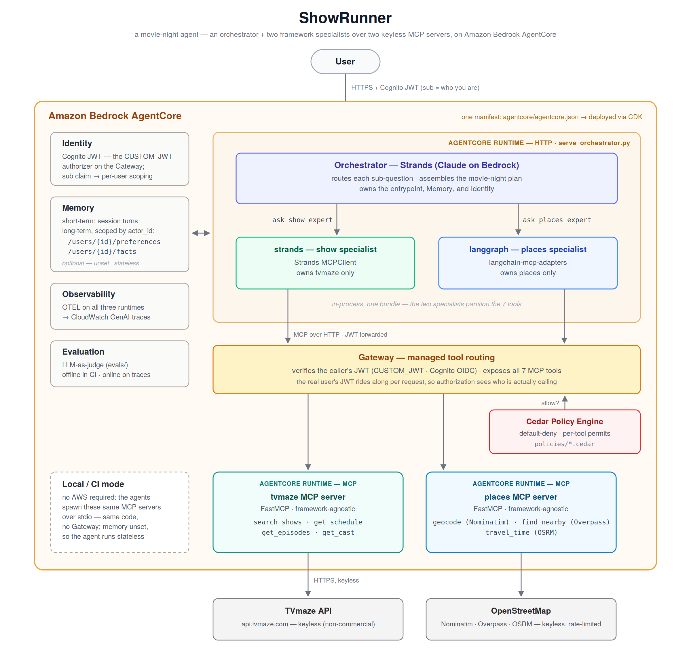

# ShowRunner 🎬

A movie-night agent: it figures out **what's on tonight**, **where you can watch it near you**, and **whether you have time to grab food first** — then plans the evening around it.

But the movie app is the vehicle, not the point. ShowRunner is a compact, runnable example of a **production-shaped agent architecture**: two agent frameworks (Strands + LangGraph) sharing the *same* two keyless MCP servers, wired into Amazon Bedrock AgentCore for memory, identity, tool routing, and evaluation.

Everything here is **free and keyless** — clone it and run it, no API signups, no billing.



---

## Why this exists

Most "AI agent" demos stop at a single framework calling a single API. ShowRunner shows the two things that actually matter when you go past a demo:

- **MCP portability** — one MCP server, consumed unchanged by two different frameworks. Swap Strands for LangGraph and the tools don't move. That's the whole promise of MCP, made concrete.
- **Production concerns** — memory across sessions, per-user identity, managed tool routing, and evaluation, added one layer at a time instead of hand-rolled.

It was also built entirely through [Claude Code](https://www.claude.com/product/claude-code)'s own workflow — plan mode, a lean `CLAUDE.md`, verified commits, subagents, and hooks — so the repo doubles as a worked example of *how* to build something like this. See [`BUILD.md`](BUILD.md).

## Architecture at a glance

| Layer | What | Keyless? |
|-------|------|----------|
| **MCP servers** | `tvmaze` (what's on) · `places` (cinemas, restaurants, travel time via OpenStreetMap) | ✅ |
| **Agents** | `strands` (primary) · `langgraph` (variant, same servers) | — |
| **AgentCore** | runtime · memory · identity · gateway · evaluation · observability | — |

Full spec: [`PROJECT.md`](PROJECT.md).

## Quickstart

Requires [uv](https://github.com/astral-sh/uv) (it manages Python and dependencies). AWS/Bedrock is only needed for the AgentCore deploy steps — the MCP servers and agents run locally without it.

```bash
git clone https://github.com/andaro74/showrunner.git
cd showrunner

uv sync                                   # rebuild the exact environment from the lockfile

uv run pytest                             # everything green?

uv run python mcp_servers/tvmaze/server.py   # run a server standalone
uv run agentcore dev                          # run the Strands agent locally
```

Copy `.env.example` to `.env` if you're wiring up the AgentCore layer; the core demo needs no secrets.

## The two MCP servers

**`tvmaze`** — over `https://api.tvmaze.com` (no key, non-commercial use).
`search_shows` · `get_schedule` · `get_episodes` · `get_cast`

**`places`** — over OpenStreetMap (no key).
`geocode` (Nominatim) · `find_nearby` (Overpass — cinemas + restaurants) · `travel_time` (OSRM)

Both are framework-agnostic FastMCP servers — they contain zero Strands or LangChain code, which is exactly why both agents can share them.

## Memory, and why Identity is what makes it safe

The Strands agent uses AgentCore Memory in two tiers ([`agents/strands/memory_config.py`](agents/strands/memory_config.py)):

- **Short-term** — the active session's turns, keyed by `(actor_id, session_id)` and replayed into the next turn.
- **Long-term** — durable records under two named namespaces, both scoped by actor:
  - `/users/{actor_id}/preferences` — genre preferences (user-preference strategy)
  - `/users/{actor_id}/facts` — what's already been suggested (semantic strategy)

  These paths mirror the `namespaceTemplates` that `agentcore add memory` provisions; if code
  and manifest drift apart, recall silently returns nothing.

**`{actor_id}` is the load-bearing part.** It comes from the `sub` claim of Identity's inbound
Cognito JWT. Without that, "who is this user?" would be a value the *caller* supplies — so anyone
could pass someone else's id and read their memory. The JWT is verified upstream by the gateway's
`CUSTOM_JWT` authorizer; the agent only decodes the already-verified claims. That's the
anti-impersonation story, and it's why the ordering rule is **Identity before Gateway**.

Note the asymmetry worth calling out: TVmaze and OpenStreetMap are *keyless* — the APIs need no
auth at all. Identity isn't here to reach the upstream data. It's here purely to keep one user's
remembered preferences from leaking into another user's movie night.

Memory is optional: with no `AGENTCORE_MEMORY_ID` set, the agent runs statelessly (that's how the
tests run — no AWS required).

## How it was built (build in public)

The repo grows one verified, single-purpose commit at a time — so `git log` *is* the tutorial:

1. Repo skeleton — `PROJECT.md`, `CLAUDE.md`, `.gitignore`, `pyproject.toml`
2. TVmaze MCP server + tests
3. Places MCP server + tests (Overpass QL researched in a subagent)
4. Strands agent — first end-to-end "plan my night"
5. LangGraph variant — same servers, second framework, no rewrites
6. Skill + hooks — guardrails become automatic
7. AgentCore memory → identity → evaluation (one commit each)
8. CI + docs

The step-by-step method, with the exact prompts used at each stage, is in [`BUILD.md`](BUILD.md).

## Project structure

```
showrunner/
├── PROJECT.md · CLAUDE.md · BUILD.md    # spec, agent memory, build guide
├── mcp_servers/tvmaze · places          # keyless, framework-agnostic
├── agents/strands · langgraph           # two frameworks, same servers
├── agentcore/                           # AgentCore manifest + CDK (flat resource model)
├── evals/                               # our LLM-as-judge harness
├── tests/                               # a test per tool
├── .claude/                             # skills, subagents, hooks (how it's built)
└── .github/workflows/ci.yml             # pytest + ruff + headless review + evals
```

## Caveats (the honest bits)

- **OpenStreetMap public endpoints are rate-limited.** Fine for a demo — set a descriptive User-Agent and cache responses. Self-host Overpass/Nominatim/OSRM for anything real.
- **TVmaze is free for non-commercial use only.**
- **Identity's role here is memory-scoping, not API-key protection.** Because the APIs are keyless, the inbound Cognito JWT exists so long-term memory is tied to a real user (anti-impersonation via the `sub` claim), not to guard a secret.
- **LangChain doesn't speak MCP natively** — the LangGraph agent bridges via `langchain-mcp-adapters`.

## License

MIT — see [LICENSE](LICENSE).

---

*Built with Claude Code. Contributions and new MCP servers welcome — what would you add as the third?*
